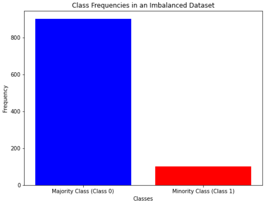

# How to handle imbalanced data in machine learning

(An imbalanced class. Image by Federico Trotta)

This repository collects the code, in a Jupyter Notebook, related to the article ["How to Handle Imbalanced Data for Machine Learning in Python"](https://semaphoreci.com/blog/imbalanced-data-machine-learning-python).

## About Federico Trotta

Hi, my name is Federico Trotta and I am a freelance Technical Writer.

Do you want to collaborate with me? [Contact me to hire me](https://bio.link/federicotrotta)!